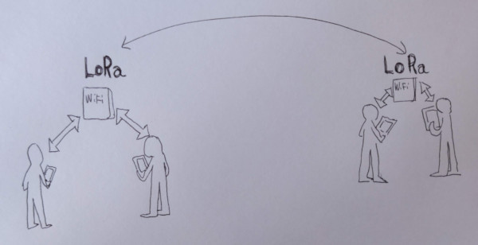

# LoRaChat

A very basic sotware to allow chat between ESP32 LoRa nodes.

* Must run in old phones (Android 4.4)
* .html + .css in external files inside ESP32 to facilitate collaboration with designers

## Installation

 * Install ESP32 board in your Arduino IDE [instructions](https://github.com/espressif/arduino-esp32/blob/master/docs/arduino-ide/boards_manager.md)
 * Install ESP32FS Arduino plugin [instructions](https://github.com/me-no-dev/arduino-esp32fs-plugin/#installation)
 * Install AsyncTCP and ESPAsyncWebServer [instructions](https://randomnerdtutorials.com/esp32-web-server-spiffs-spi-flash-file-system/)
 * Install LoRa library [link](https://github.com/sandeepmistry/arduino-LoRa) using the arduino library manager. 

## Development

 All css + js + html are in the data/web folder

 **protocol**
 the exchanged messages have the following format 
 
   sender|payload

## References

 * https://github.com/me-no-dev/ESPAsyncWebServer#async-websocket-plugin
 * https://medium.com/@martin.sikora/node-js-websocket-simple-chat-tutorial-2def3a841b61
 